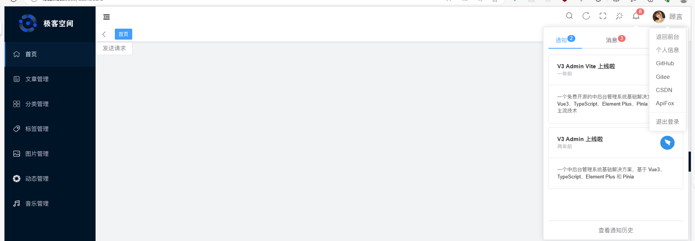
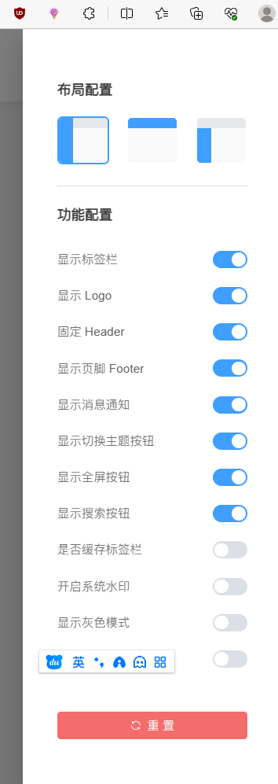
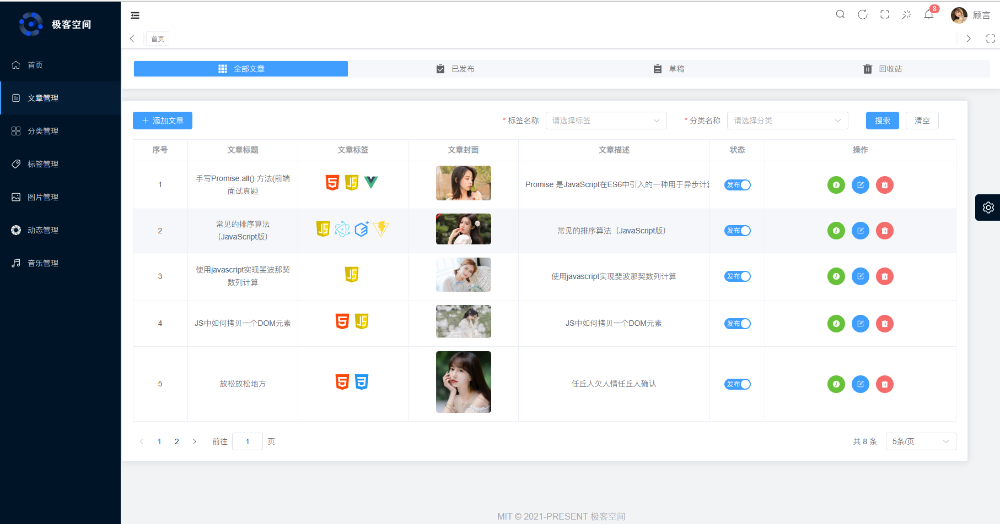
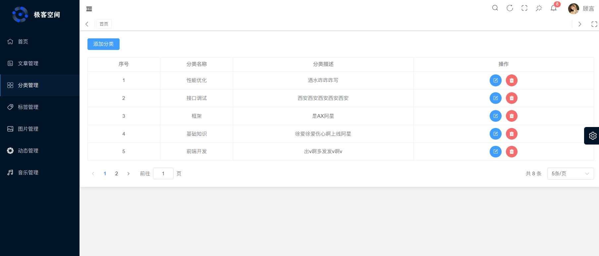

<div align="center">
  
  <h1>极客空间</h1>
  <span>个人博客系统</span>
</div>

## ⚡ 简介

极客空间是一一款用于个人博客搭建的系统，包含后台管理与前台展示两个部分。
技术架构：
- **前端**
    前端采用当前最流行的Vue3,TypeScript,Element Plus,Pinia 等主要技术，并使用Vite进行构建。是基于网络流行的*V3 Admin Vite*项目二次开发而来，加入了许多个人开发者使用的实用功能，包括代码高亮，富文本编辑等。
- **后端**
    后端采用当前前端开发和最易学习的技术Node.js最流行的框架Express开发，才数据库层面采用了对JavaScript非常友好的MongoDB数据库。在后端程序与数据库操作层面使用了Mongoose进行数据操作，在前端页面与后端程序交互层面使用了Axios进行网络请求。


国内仓库：[Gitee](https://gitee.com/un-pany/v3-admin-vite)

## 📚 文档

- 中文文档：暂无
- 手摸手教程：暂无
## 📺 在线预览

| 位置         | 账号            | 链接                                            |
| ------------ | --------------- | ----------------------------------------------- |
| github-pages | admin 或 editor | [链接]() |


## 🔥 接口文档

- [接口文档](https://www.apifox.cn/apidoc/shared-9d9a5c9f-9c5d-4c8d-9d3b-8a8d5b5f8d5b/api-5165758)


## ✨ 特点

- **非常简洁**：没有复杂的封装，没有复杂的类型体操，开箱即用
- **详细的注释**：各个配置项都写有尽可能详细的注释
- **有点规整**: 代码风格统一，命名风格统一，注释风格统一


## 🛠 技术栈

**1.前端**:

- **Vue3**：采用 Vue3 + script setup 最新的 Vue3 组合式 API
- **Element Plus**：Element UI 的 Vue3 版本
- **Pinia**: 传说中的 Vuex5
- **Vite**：真的很快
- **Vue Router**：路由路由
- **TypeScript**：JavaScript 语言的超集
- **Scss**：和 Element Plus 保持一致
- **CSS 变量**：主要控制项目的布局和颜色
- **ESlint**：代码校验
- **Prettier**：代码格式化
- **Axios**：发送网络请求（已封装好）
- **HighLight.js**：代码高亮
- **Vue/Quil**：富文本编辑
- **VueUse**: 各种有用的 Vue 工具函数
- **Echarts**: 数据可视化
- **V3-waterfall**： 瀑布流布局
- **File-Saver**：文件下载
- **Vue3-emoji-picker**: 表情包输入

**2.后端**：

- **Node.js**：使用js编写后端程序
- **Express**：后端框架
- **Mongoose**：数据库操作
- **MongoDB**：数据库
- **Multer**：文件上传
- **Cors**：跨域
- **JWT**：用户认证
- **Dotenv**：环境变量
- **Dayjs**：日期处理


 
## 🎨 功能

**1.后台**

- **文章管理**： 文章发表，预览，修改，删除等
- **分类管理**： 分类列表、分类详情、分类编辑、分类删除
- **用户信息管理**：个人信息编辑修改
- **标签管理**：文章标签列表、文章标签详情、文章标签编辑、文章标签删除
- **相册管理**：图片上传，更新，预览，下载等
- **动态管理**: 个人动态发布，个人动态删除等
- **音乐管理**：博客音乐上传，修改等
- **其他内置功能**：SVG、动态侧边栏、动态面包屑、标签页快捷导航、Screenfull 全屏、自适应收缩侧边栏、Hook（Composables）

**2.前台**
- **首页**: 首页轮播图、文章列表、标签云,个人信息展示，分类标签展示
- **文章**： 文章详情、文章列表，点赞，浏览，收藏
- **相册**： 图片列表，图片详情，图片下载
- **音乐**： 音乐列表，音乐详情，音乐播放器
- **动态**： 个人动态列表，个人动态详情


## 📥 安装依赖

```bash
# 配置
1. node 版本 18.x 或 20+
2. pnpm 版本 8.x 或最新版

# 克隆项目
git clone https://gitee.com/DT-guyan/geek-space.git

# 安装依赖
npm install 

# 启动服务
npm run dev // 前端
npm run serve // 后端

# 打包
npm run build

```

## 📑 目录结构
```bash
    ├── web                  # 前端项目
    │   ├── public           # 静态资源
    │   ├── src              # 源码
    │   │   ├── api          # 项目接口
    │   │   ├── assets       # 项目静态资源
    │   │   ├── components   # 公共组件
    │   │   ├── config       # 配置文件
    │   │   ├── constants    # 常量
    │   │   ├── directive    # 自定义指令
    │   │   ├── home         # 前台布局组件
    │   │   ├── hooks        # 自定义 Hook
    │   │   ├── icons        # svg图标
    │   │   ├── layouts      # 后台布局组件
    │   │   ├── pages        # 前台页面
    │   │   ├── plugins      # 插件
    │   │   ├── router       # 路由
    │   │   ├── store        # 状态管理
    │   │   ├── styles       # 样式
    │   │   ├── types        # 源码中用到的自定义类型
    │   │   ├── utils        # 工具函数
    │   │   ├── views        # 后台页面
    │   │   ├── App.vue      # 入口文件
    │   │   └── main.ts      # 入口文件
    │   ├── .env             # 环境变量
    │   ├── types            # 类型定义
    │   ├── vite.config.ts   # Vite 配置
    │   └── ...              # 其他配置
    ├── server               # 后端项目
    │   ├── bin              # 入口文件
    │   ├── config           # 配置文件
    │   ├── controller       # 控制器-请求处理
    │   ├── model            # 数据库模型
    │   ├── routes           # 请求路由
    │   ├── service          # 数据库操作
    │   ├── routes           # 请求路由
    │   ├── utils            # 工具函数
    │   ├── app.js           # 入口文件
    │   ├── .env             # 环境变量
    │   └── ...              # 其他配置
```
## 📑 前端页面（后台）
<div align="center">
  <h2>🔍 前端-后台页面</h2>
</div>

### 整体架构
**1.页头**

1. 搜索按钮 - 点击开启搜索弹框进行搜索
2. 刷新按钮 - 点击刷新页面（刷新主内容区域的页面内容-——刷新路由）
3. 全屏按钮 - 点击切换全屏
4. 主题按钮 - 点击切换主题（默认，黑暗，蓝色）
5. 消息通知按钮 - 点击跳转到消息通知面板
6. 用户头像及昵称 - 点击显示用户快捷操作面板
7. 内容区域放大按钮 - 点击放大内容区域 / 内容区域全屏

**2.侧边栏**

1. 网站logo展示 - 单击跳转到前台页面
2. 导航菜单 - 点击跳转到对应页面
3. 侧边栏收缩按钮 - 点击收缩侧边栏

**3.网站设置**:

1. 布局设置
2. logo显示
3. Header显示
.....


### 1.登录页面


**功能介绍：**
1. 用户输入
用户名：用户需要在此处输入其用于登录系统的用户名。

密码：用户需要在此处输入与用户名关联的密码。

验证码：用户需要输入显示的验证码，以确保登录请求是由真实用户发起的（此处使用模拟验证码形式）。

2. 登录按钮
用户填写完用户名、密码（以及验证码，如果适用）后，可以点击登录按钮来提交登录请求。

3. 登录失败提示
如果用户输入的用户名或密码错误，或者验证码错误，则登录失败。此时，系统会提示用户输入错误，并要求用户重新输入。
4. 登录成功提示
如果用户输入的用户名和密码正确，并且验证码正确（如果适用），则登录成功。此时，系统会提示用户登录成功，并跳转到后台管理页面首页。

**技术重点:**
此页面的技术重点在于用户登录逻辑验证，包括用户名、密码的校验。以及用户登录状态的保存（token）与用户跳转。
### 2.后台首页

**功能介绍：**
### 3.文章管理

**功能介绍:**
1. 文章列表
文章列表中显示了所有已发布的文章，包括标题、标签、发布时间、封面和操作。
2. 添加文章
用户可以点击“添加文章”按钮来添加新文章。此时，系统会跳转到添加文章的页面。
3. 编辑文章
用户可以点击文章列表中的“编辑”按钮来编辑已发布的文章。此时，系统会跳转到编辑文章的页面。
4. 删除文章（可恢复）
用户可以点击文章列表中的“删除”按钮来删除已发布的文章。此时，系统会弹出确认对话框，询问用户是否确认删除文章。如果用户确认删除，则文章将被删除。
5. 文章预览
用户可以点击文章列表中的“预览”按钮来查看已发布的文章的预览。此时，系统会跳转到文章预览页面。
6. 文章发布切换
用户可以点击文章列表中的“发布”按钮来切换已发布的文章的状态。如果文章状态为“未发布”，则点击后，系统会将该文章设置为已发布；如果文章状态为“已发布”，则点击后，系统会将该文章设置为草稿。
7. 文章搜索：
用户可以输入文章分类和标签，来搜索符合条件的文章。
8. 文章分类：
用户可以点击顶部的导航栏切换文章分类。
9. 删除文章（不可恢复）
用户需先切换到回收站栏目下，点击文章列表中的“删除”按钮来删除已发布的文章。此时，系统会弹出确认对话框，询问用户是否确认删除文章。如果用户确认删除，则文章将被永久删除，无法恢复。
10. 批量删除
用户需先切换到回收站栏目下，点击文章列表中的“批量删除”按钮来批量删除已发布的文章。此时，系统会弹出确认对话框，询问用户是否确认批量删除
11. 删除恢复
用户需先切换到回收站栏目下，点击文章列表中的“删除文件恢复”按钮来批量恢复已发布的文章。

**技术重点:**
1. 文章列表的展示与分页
```jsx
    <el-table :data="articleList" border >
        <el-table-column v-if="articleType !== 4" align="center" width="100" label="序号" type="index" />
        <el-table-column v-else align="center" type="selection" width="100" />
        <el-table-column prop="title" align="center" width="200" label="文章标题" />
        <el-table-column align="center" width="200" label="文章标签">
          <template v-slot="{ row }">
            <span v-for="item in row.tags" :key="item._id">
              <el-image style="width: 30px; height: 30px; margin-right: 5px" :src="item.icon" fit="fill" />
            </span>
          </template>
        </el-table-column>
        <el-table-column prop="cover" align="center" width="200" label="文章封面">
          <template v-slot="{ row }">
            <el-image :src="row.cover" style="width: 100px; border-radius: 5px" />
          </template>
        </el-table-column>
        <el-table-column show-overflow-tooltip prop="desc" align="center" label="文章描述">
          <template v-slot="{ row }">
            <div class="desc">{{ row.desc }}</div>
          </template>
        </el-table-column>
        <el-table-column width="100" prop="desc" align="center" label="状态">
          <template v-slot="{ row }">
            <el-switch
              v-if="articleType !== 4"
              v-model="row.isPublish"
              @change="changePublish(row._id, row.isPublish)"
              active-text="发布"
              inactive-text="草稿"
              inline-prompt
            />
            <el-switch
              v-else
              v-model="row.isDelete"
              @change="restoreArticle(row._id)"
              active-text="已删除"
              inactive-text="未删除"
              inline-prompt
            />
          </template>
        </el-table-column>

        <el-table-column prop="desc" align="center" label="操作">
          <template v-slot="{ row }">
            <el-button
              v-if="articleType !== 4"
              type="success"
              :name="row"
              @click="previewArticle(row._id)"
              :icon="InfoFilled"
              circle
            />
            <el-button v-if="articleType !== 4" type="primary" @click="updateArticle(row._id)" :icon="Edit" circle />
            <el-button
              v-if="articleType !== 4"
              type="danger"
              @click="deleteArticle(row._id)"
              :icon="DeleteFilled"
              circle
            />
            <el-button
              v-if="articleType === 4"
              type="danger"
              @click="deleteArticlePermanently(row._id)"
              :icon="DeleteFilled"
              >删除</el-button
            >
          </template>
        </el-table-column>
      </el-table>

```
2. 添加文章富文本编辑器使用与代码高亮

```jsx
// 导入必要的组件
import { QuillEditor } from "@vueup/vue-quill"
import "@vueup/vue-quill/dist/vue-quill.snow.css"
import hljs from "highlight.js"
import "highlight.js/styles/monokai-sublime.css"

// 富文本编辑器配置项
const Options = {
  theme: "snow",
  placeholder: "请在这里输入",
  modules: {
    toolbar: {
      container: [
        // [{ 'header': 1 }, { 'header': 2 }], // 标题 —— 独立平铺
        [{ header: [1, 2, 3, 4, 5, 6, false] }], // 标题 —— 下拉选择
        [{ size: ["small", false, "large", "huge"] }], // 字体大小
        [{ list: "ordered" }, { list: "bullet" }], // 有序、无序列表
        ["blockquote", "code-block"], // 引用  代码块
        // 链接按钮需选中文字后点击
        ["link", "image", "video"], // 链接、图片、视频
        [{ align: [] }], // 对齐方式// text direction
        [{ indent: "-1" }, { indent: "+1" }], // 缩进
        ["bold", "italic", "underline", "strike"], // 加粗 斜体 下划线 删除线
        [{ color: [] }, { background: [] }], // 字体颜色、字体背景颜色
        [{ script: "sub" }, { script: "super" }], // 下标/上标
        [{ font: [] }], //字体
        ["clean"] // 清除文本格式
      ]
    },
    syntax: {
      highlight: (text: string) => {
        return hljs.highlightAuto(text).value // 这里就是代码高亮需要配置的地方
      }
    }
  }
}

// 富文本编辑器组件
        <QuillEditor
            v-model:content="articleForm.content"
            ref="quillRef"
            style="width: 100%; height: 300px"
            contentType="html"
            :options="Options"
          />
```
3. 文章预览代码高亮

```jsx
// 全局注册组件hljsVuePlugin
import hljs from "highlight.js/lib/core"
import javascript from "highlight.js/lib/languages/javascript"
import hljsVuePlugin from "@highlightjs/vue-plugin"

// 注册需要的语言
hljs.registerLanguage("javascript", javascript)

// 挂载
app.use(hljsVuePlugin)
```
通过以上操作在项目中如果有以pre标签包裹的代码块，就可以实现代码高亮。

### 4.文章标签页面

**功能介绍:**
1. 标签列表：
文章标签内容，图片，名称，描述，创建时间，操作（编辑，删除）。
2. 标签添加：
通过drawer弹框编辑标签信息，上传添加标签。
3. 标签编辑：
获取标签详情，通过drawer弹框回显编辑标签信息。
4. 标签删除：
点击删除按钮，弹出确认框，确认删除后，删除标签。（永久删除）
5. 标签详情预览:
点击标签详情预览按钮，打开弹框渲染标签详情数据。

**技术重点:**
1. 标签添加：
标签添加过程表单校验，图片上传，标签添加成功后，关闭弹框。（注意： 标签位置只允许上传svg图标）

2. 标签列表编渲染及分页：
通过el-table组件渲染标签列表，使用分页插件渲染分页。

### 5.文章分类页面

**功能介绍:**
1. 分类列表：
文章分类内容，图片，名称，描述，创建时间，操作（编辑，删除）。
2. 分类添加：
通过drawer弹框编辑分类信息，上传添加分类。
3. 分类编辑：
获取分类详情，通过dialog弹框回显编辑分类信息。
4. 分类删除：
点击删除按钮，弹出确认框，确认删除后，删除分类。（永久删除）


