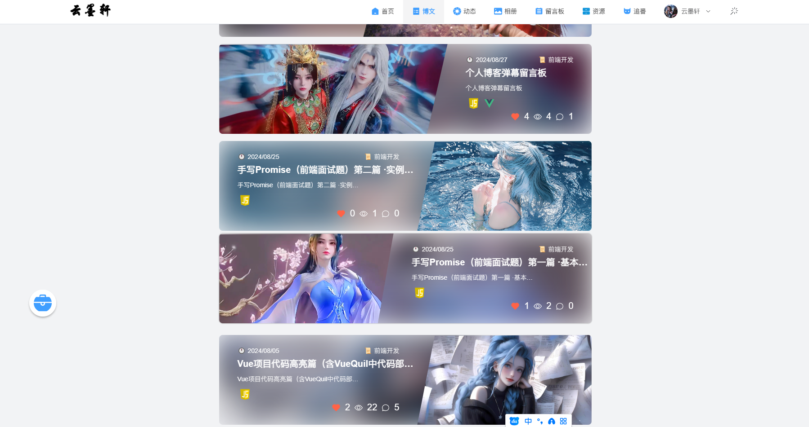

<div align="center">
  
  <h1>云墨轩</h1>
  <span>个人博客系统</span>
</div>

## ⚡ 简介

云墨轩是一一款个人博客管理系统，包含后台管理与前台展示两个部分。前台展示部分名为<strong>云墨轩</strong>，后台管理部分名为<strong>极客空间</strong>。

技术架构：
- **前端**
    前端采用当前最流行的Vue3,TypeScript,Element Plus,Pinia 等主要技术，并使用Vite进行构建。是基于网络流行的*V3 Admin Vite*项目二次开发而来，加入了许多个人开发者使用的实用功能，包括代码高亮，富文本编辑等， 瀑布流布局等。
- **后端**
    后端采用当前前端开发和最易学习的技术Node.js最流行的框架Express开发，数据库层面采用了对JavaScript非常友好的MongoDB数据库。在后端程序与数据库操作层面使用了Mongoose进行数据操作，在前端页面与后端程序交互层面使用了Axios进行网络请求。


## 📚 文档

- 中文文档：[稀土掘金](https://juejin.cn/post/7408858278699384870)
- 接口文档：[ApiFox](https://apifox.com/apidoc/shared-c6adb94b-1fdc-4dbd-9933-e7962342092e)
## 📺 在线预览
[云墨轩](http://jeek-space-blog.top)

## 🔥 接口文档

- [接口文档](https://apifox.com/apidoc/shared-c6adb94b-1fdc-4dbd-9933-e7962342092e)


## ✨ 特点

- **非常简洁**：没有复杂的封装，没有复杂的类型体操，开箱即用
- **详细的注释**：各个配置项都写有尽可能详细的注释
- **有点规整**: 代码风格统一，命名风格统一，注释风格统一


## 🛠 技术栈

**1.前端**:

- **Vue3**：采用 Vue3 + script setup 最新的 Vue3 组合式 API
- **Element Plus**：Element UI 的 Vue3 版本
- **Pinia**: 传说中的 Vuex5
- **Vite**：真的很快
- **Vue Router**：路由路由
- **TypeScript**：JavaScript 语言的超集
- **Scss**：和 Element Plus 保持一致
- **CSS 变量**：主要控制项目的布局和颜色
- **ESlint**：代码校验
- **Prettier**：代码格式化
- **Axios**：发送网络请求（已封装好）
- **HighLight.js**：代码高亮
- **Vue/Quil**：富文本编辑
- **VueUse**: 各种有用的 Vue 工具函数
- **Echarts**: 数据可视化
- **V3-waterfall**： 瀑布流布局
- **File-Saver**：文件下载
- **Vue3-emoji-picker**: 表情包输入
- **UnoCss**：原子化 CSS
- **WebSocket**：Websocket

**2.后端**：

- **Node.js**：使用js编写后端程序
- **Express**：后端框架
- **Mongoose**：数据库操作
- **MongoDB**：数据库
- **Multer**：文件上传
- **Cors**：跨域
- **JWT**：用户认证
- **Dotenv**：环境变量
- **Dayjs**：日期处理
- **ws**：Websocket
- **Useragent**：浏览器用户信息处理


 
## 🎨 功能

**1.后台**

- **文章管理**： 文章发表，预览，修改，删除等
- **分类管理**： 分类列表、分类详情、分类编辑、分类删除
- **用户信息管理**：个人信息编辑修改
- **标签管理**：文章标签列表、文章标签详情、文章标签编辑、文章标签删除
- **相册管理**：图片上传，更新，预览，下载等
- **动态管理**: 个人动态发布，个人动态删除等
- **留言管理**: 留言列表，留言删除等
- **资源管理**： 资源记录，更新，删除等
- **追番管理**： 追番列表，追番详情，追番编辑，追番删除,动漫图片上传，删除
- **其他内置功能**：SVG、动态侧边栏、动态面包屑、标签页快捷导航、Screenfull 全屏、自适应收缩侧边栏、Hook（Composables）

**2.前台**
- **首页**: 首页轮播图、文章列表、标签云,个人信息展示，分类标签展示，网站访问数据展示并记录
- **文章**： 文章详情、文章列表，点赞，浏览，详情，评论，一键复制代码，上一页下一页切换
- **相册**： 图片列表，图片详情，图片下载，图片预览
- **动态**： 个人动态列表，个人动态详情，评论，点赞，预览
- **留言板**: 留言信息弹幕墙效果展示，添加留言，留言列表渲染
- **资源**: 资源列表渲染
- **追番**： 追番列表，追番详情
- **工具箱模块**: 
  1. 页面鼠标点击特效
  2. 页面滑动置顶功能
  3. 文章搜索功能
  4. 鼠标样式特效
  5. 鼠标拖尾特效

- **其他内置功能**： 个人详情信息页面，系统日志页面，面试记录页面等等
- **移动端适配**: 前台页面适配移动端web应用，但由于移动端屏幕较小，部分功能未做适配。


## 📥 安装依赖

```bash
# 配置
1. node 版本 18.x 或 20+
2. pnpm 版本 8.x 或最新版

# 克隆项目
git clone https://gitee.com/DT-guyan/geek-space.git

# 安装依赖
npm install 

# 启动服务
npm run dev // 前端
npm run serve // 后端

# 打包
npm run build

```

## 📑 目录结构
```bash
    ├── web                  # 前端项目
    │   ├── public           # 静态资源
    │   ├── src              # 源码
    │   │   ├── api          # 项目接口
    │   │   ├── assets       # 项目静态资源
    │   │   ├── components   # 公共组件
    │   │   ├── config       # 配置文件
    │   │   ├── constants    # 常量
    │   │   ├── directive    # 自定义指令
    │   │   ├── home         # 前台布局组件
    │   │   ├── hooks        # 自定义 Hook
    │   │   ├── icons        # svg图标
    │   │   ├── layouts      # 后台布局组件
    │   │   ├── pages        # 前台页面
    │   │   ├── plugins      # 插件
    │   │   ├── router       # 路由
    │   │   ├── store        # 状态管理
    │   │   ├── styles       # 样式
    │   │   ├── types        # 源码中用到的自定义类型
    │   │   ├── utils        # 工具函数
    │   │   ├── views        # 后台页面
    │   │   ├── App.vue      # 入口文件
    │   │   └── main.ts      # 入口文件
    │   ├── .env             # 环境变量
    │   ├── types            # 类型定义
    │   ├── vite.config.ts   # Vite 配置
    │   └── ...              # 其他配置
    ├── server               # 后端项目
    │   ├── bin              # 入口文件
    │   ├── config           # 配置文件
    │   ├── controller       # 控制器-请求处理
    │   ├── model            # 数据库模型
    │   ├── routes           # 请求路由
    │   ├── service          # 数据库操作
    │   ├── routes           # 请求路由
    │   ├── utils            # 工具函数
    │   ├── app.js           # 入口文件
    │   ├── .env             # 环境变量
    │   └── ...              # 其他配置
```
## 📑 前端页面（后台）
<div align="center">
  <h2>🔍 前端-后台页面</h2>
</div>

### 整体架构
**1.页头**

1. 搜索按钮 - 点击开启搜索弹框进行搜索
2. 刷新按钮 - 点击刷新页面（刷新主内容区域的页面内容-——刷新路由）
3. 全屏按钮 - 点击切换全屏
4. 主题按钮 - 点击切换主题（默认，黑暗，蓝色）
5. 消息通知按钮 - 点击跳转到消息通知面板
6. 用户头像及昵称 - 点击显示用户快捷操作面板
7. 内容区域放大按钮 - 点击放大内容区域 / 内容区域全屏

**2.侧边栏**

1. 网站logo展示 - 单击跳转到前台页面
2. 导航菜单 - 点击跳转到对应页面
3. 侧边栏收缩按钮 - 点击收缩侧边栏

**3.网站设置**:

1. 布局设置
2. logo显示
3. Header显示
.....


### 1.登录页面


**功能介绍：**
1. 用户输入
用户名：用户需要在此处输入其用于登录系统的用户名。

密码：用户需要在此处输入与用户名关联的密码。

验证码：用户需要输入显示的验证码，以确保登录请求是由真实用户发起的（此处使用模拟验证码形式）。

2. 登录按钮
用户填写完用户名、密码（以及验证码，如果适用）后，可以点击登录按钮来提交登录请求。

3. 登录失败提示
如果用户输入的用户名或密码错误，或者验证码错误，则登录失败。此时，系统会提示用户输入错误，并要求用户重新输入。
4. 登录成功提示
如果用户输入的用户名和密码正确，并且验证码正确（如果适用），则登录成功。此时，系统会提示用户登录成功，并跳转到后台管理页面首页。

**技术重点:**
此页面的技术重点在于用户登录逻辑验证，包括用户名、密码的校验。以及用户登录状态的保存（token）与用户跳转。
### 2.后台首页

**功能介绍：**
1. 首页数统计
统计当前系统网站文章数据，标签数据，图片数据信息并展示。
2. 快捷操作
提供全集跳转到各个子模块的操作。
3. 文章和动态详细信息的展示统计
4. 日历组件
5. 动态及文章的评论信息滚动展示
6. 评论信息展示及系统日志记录展示（右上角消息图标）

### 3.文章管理

**功能介绍:**
1. 文章列表
文章列表中显示了所有已发布的文章，包括标题、标签、发布时间、封面和操作。
2. 添加文章
用户可以点击“添加文章”按钮来添加新文章。此时，系统会跳转到添加文章的页面。
3. 编辑文章
用户可以点击文章列表中的“编辑”按钮来编辑已发布的文章。此时，系统会跳转到编辑文章的页面。
4. 删除文章（可恢复）
用户可以点击文章列表中的“删除”按钮来删除已发布的文章。此时，系统会弹出确认对话框，询问用户是否确认删除文章。如果用户确认删除，则文章将被删除。
5. 文章预览
用户可以点击文章列表中的“预览”按钮来查看已发布的文章的预览。此时，系统会跳转到文章预览页面。
6. 文章发布切换
用户可以点击文章列表中的“发布”按钮来切换已发布的文章的状态。如果文章状态为“未发布”，则点击后，系统会将该文章设置为已发布；如果文章状态为“已发布”，则点击后，系统会将该文章设置为草稿。
7. 文章搜索：
用户可以输入文章分类和标签，来搜索符合条件的文章。
8. 文章分类：
用户可以点击顶部的导航栏切换文章分类。
9. 删除文章（不可恢复）
用户需先切换到回收站栏目下，点击文章列表中的“删除”按钮来删除已发布的文章。此时，系统会弹出确认对话框，询问用户是否确认删除文章。如果用户确认删除，则文章将被永久删除，无法恢复。
10. 批量删除
用户需先切换到回收站栏目下，点击文章列表中的“批量删除”按钮来批量删除已发布的文章。此时，系统会弹出确认对话框，询问用户是否确认批量删除
11. 删除恢复
用户需先切换到回收站栏目下，点击文章列表中的“删除文件恢复”按钮来批量恢复已发布的文章。

**技术重点:**
1. 文章列表的展示与分页


2. 添加文章富文本编辑器使用与代码高亮


3. 文章预览代码高亮


```js
// 全局注册组件hljsVuePlugin
import hljs from "highlight.js/lib/core"
import javascript from "highlight.js/lib/languages/javascript"
import hljsVuePlugin from "@highlightjs/vue-plugin"

// 注册需要的语言
hljs.registerLanguage("javascript", javascript)

// 挂载
app.use(hljsVuePlugin)
```

### 4.文章标签页面

**功能介绍:**
1. 标签列表：
文章标签内容，图片，名称，描述，创建时间，操作（编辑，删除）。
2. 标签添加：
通过drawer弹框编辑标签信息，上传添加标签。
3. 标签编辑：
获取标签详情，通过drawer弹框回显编辑标签信息。
4. 标签删除：
点击删除按钮，弹出确认框，确认删除后，删除标签。（永久删除）
5. 标签详情预览:
点击标签详情预览按钮，打开弹框渲染标签详情数据。

**技术重点:**
1. 标签添加：
标签添加过程表单校验，图片上传，标签添加成功后，关闭弹框。（注意： 标签位置只允许上传svg图标）
2. 标签列表编渲染及分页：
通过el-table组件渲染标签列表，使用分页插件渲染分页。


### 5.文章分类页面

**功能介绍:**
1. 分类列表：
文章分类内容，图片，名称，描述，创建时间，操作（编辑，删除）。
2. 分类添加：
通过drawer弹框编辑分类信息，上传添加分类。
3. 分类编辑：
获取分类详情，通过dialog弹框回显编辑分类信息。
4. 分类删除：
点击删除按钮，弹出确认框，确认删除后，删除分类。（永久删除）

### 6.图片管理页面

**功能介绍:**
1. 图片上传
2. 图片列表分类展示
3. 图片删除，预览，详情展示，下载
4. 图片分组展示
5. 精选图片轮播展示
6. 编辑分组（添加，编辑，删除分组）
7. 图片瀑布流布局展示

### 7.动态管理页面

**功能介绍:**
1. 个人信息展示
2. 动态列表展示
3. 动态列表触底加载
4. 动态数据统计
5. 动态发布
6. 动态点赞 + 动态评论
7. 动态修改，预览，删除

### 8.留言管理页面

**功能介绍:**
1. 留言列表展示
2. 留言删除

### 9.资源管理页面

**功能介绍:**
1. 资源列表分类展示
2. 添加资源分组
3. 添加左缘
4. 修改删除资源分组
5. 修改删除资源信息
左键单击资源卡片右上角的标签图标，弹出修改资源弹框
右击资源卡片右上角的标签图标，弹出删除资源弹框
单击设置标签图标，弹出设置修改或删除资源分组弹框

### 10.追番管理页面

**功能介绍:**
1. 追番列表展示
2. 追番添加
3. 动漫详情
  ;
4. 动漫详情信息展示
5. 动漫图片分页加载展示
6. 动漫修改删除
7. 图片右击选择批量删除
8. 动漫图片添加
  


## 📑 前端页面（前台）
<div align="center">
  <h2>🔍 前端-前台页面</h2>
</div>

**以下效果均为PC端效果展示，移动端效果待补充**
### 1.首页
  ;
  ;
  ;

**功能介绍:**
1. 首页随机诗句打字机打字效果
2. 首页推荐文章显示
3. 个人信息，分类信息，标签信息展示
4. 标签图标点击显示标签详细信息
5. 公众号二维码显示
6. 工具箱
7. 底部版权区域访问量展示及上线时间计算
8. 底部版权区域备案信息展示及个人账号信息展示

### 2.博文
;
;

**功能介绍:**
1. 精选图片全景轮播图展示
2. 文章列表展示
3. 文章点赞
4. 文章分页加载

### 3.动态
;
**功能介绍:**
1. 动态列表展示
2. 动态列表触底加载
3. 动态点赞 + 动态评论


### 4.相册
;
;
**功能介绍:**
1. 相册分类展示
2. 相册图片列表展示
3. 图片下载

### 5.留言板
;
;

**功能介绍:**
1. 留言弹幕墙展示
2. 添加留言
3. 留言分页展示

### 6.资源
;
**功能介绍:**
1. 资源列表分类展示

### 7.追番
;
;
**功能介绍:**
1. 追番列表展示
2. 追番详情
3. 动漫图片分页加载展示
### 8.文章详情
;
;

**功能介绍:**
1. 文章详情展示
2. 文章评论
3. 代码复制
4. 上一页下一页切换

### 9.个人资料
;

## 📑 后端接口 
<div align="center">
  <h2><a href="https://apifox.com/apidoc/shared-c6adb94b-1fdc-4dbd-9933-e7962342092e">🔍 极客空间</a></h2>
</div>


