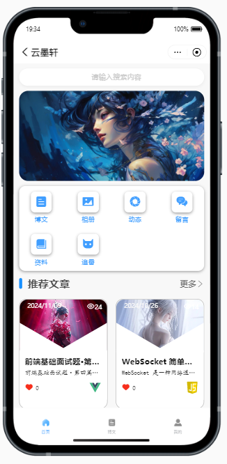
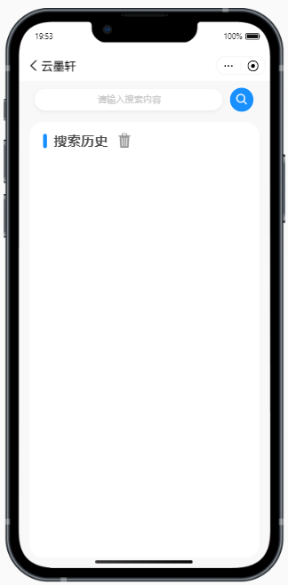
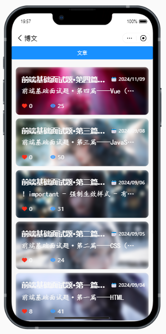
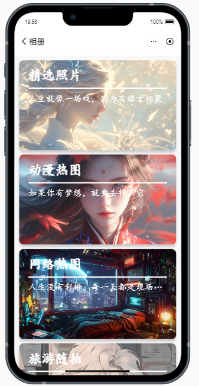
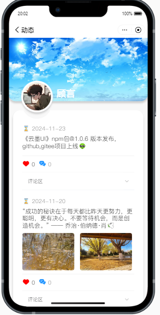
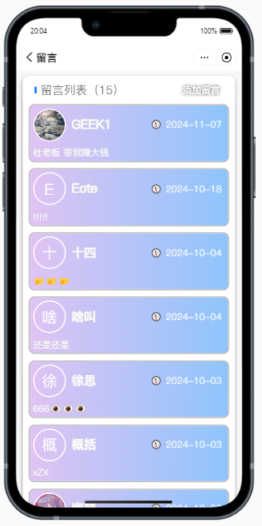
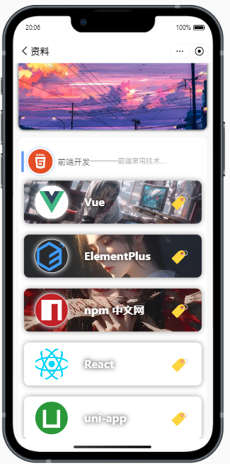
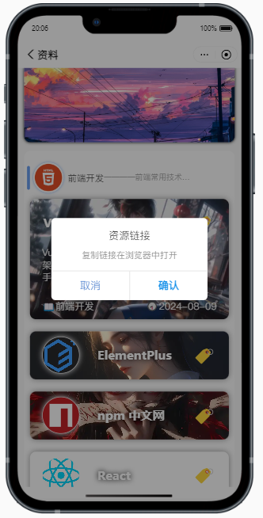

# 1.首页

##   项目简介

- 本项目对应的小程序项目名为`云墨轩-前端`,现已上线支付宝小程序平台，可以在支付宝搜索`云墨轩-前端`找到，或者可以进入博客网站首页扫码查看。

## 技术栈
- 小程序端和前端网站共用同一套后端接口。
- **小程序**： `uni-app` + `uni-ui` + `vite` + `支付宝相关的api`
- **语言**: `Javascript` 

##  1.小程序首页

###  项目截图

###  项目功能
1. 首页提供文章检索功能，可以按照文章标题、文章标签、文章分类进行检索。（模糊查询）
2. 首页展示推荐文章和小程序相关的各个模块。

## 2.搜索页

### 功能
1. 输入关键字搜索文章
2. 搜索历史保存再本地
3. 搜索历史课单个删除和全部删除
4. 搜索历史是否保存取决于设置页面的保存设置

## 3.相册页

### 功能
1. 展示相册分类和相册列表
2. 提供图片预览功能
3. 长按图片弹出操作菜单，可以保存下载到本地
4. 图片采用懒加载方式，提升页面加载速度

## 4.动态页

### 功能
1. 动态信息展示
2. 动态图片预览与下载
3. 动态评论展示

## 5.留言页

### 功能
1. 留言展示
2. 留言添加

## 6.资料页

### 功能
1. 资料卡片展示
2. 点击资料卡片展示详情介绍
3. 点击右侧的标签符号复制链接（如需访问链接需要自行到浏览器访问）

## 7.追番页

### 功能
1. 追番动漫信息展示
2. 点击展开详情
3. 右划卡片展开操作菜单，点击图片图标跳转到动漫详情页
4. 详情页图片预览与下载

