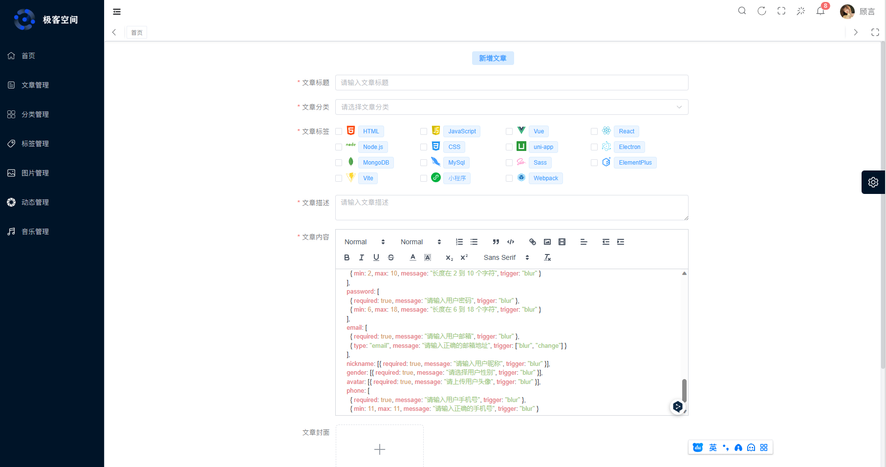
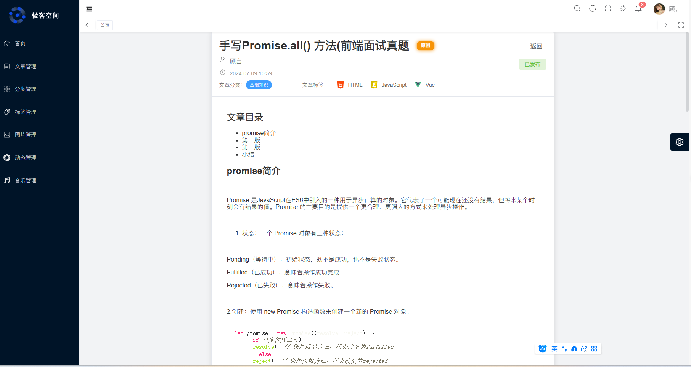

# 4.文章管理

## 功能介绍
**1. 文章列表**
文章列表中显示了所有已发布的文章，包括标题、标签、发布时间、封面和操作。

**2. 添加文章**
用户可以点击“添加文章”按钮来添加新文章。此时，系统会跳转到添加文章的页面。

**3. 编辑文章**
用户可以点击文章列表中的“编辑”按钮来编辑已发布的文章。此时，系统会跳转到编辑文章的页面。

**4. 删除文章（可恢复）**
用户可以点击文章列表中的“删除”按钮来删除已发布的文章。此时，系统会弹出确认对话框，询问用户是否确认删除文章。如果用户确认删除，则文章将被删除。

**5. 文章预览**
用户可以点击文章列表中的“预览”按钮来查看已发布的文章的预览。此时，系统会跳转到文章预览页面。

**6. 文章发布切换**
用户可以点击文章列表中的“发布”按钮来切换已发布的文章的状态。如果文章状态为“未发布”，则点击后，系统会将该文章设置为已发布；如果文章状态为“已发布”，则点击后，系统会将该文章设置为草稿。

**7. 文章搜索**
用户可以输入文章分类和标签，来搜索符合条件的文章。

**8. 文章分类**
用户可以点击顶部的导航栏切换文章分类。

**9. 删除文章（不可恢复）**
用户需先切换到回收站栏目下，点击文章列表中的“删除”按钮来删除已发布的文章。此时，系统会弹出确认对话框，询问用户是否确认删除文章。如果用户确认删除，则文章将被永久删除，无法恢复。

**10. 批量删除**
用户需先切换到回收站栏目下，点击文章列表中的“批量删除”按钮来批量删除已发布的文章。此时，系统会弹出确认对话框，询问用户是否确认批量删除。

**11. 删除恢复**
用户需先切换到回收站栏目下，点击文章列表中的“删除文件恢复”按钮来批量恢复已发布的文章。

## 技术重点
1. 文章列表的展示与分页


2. 添加文章富文本编辑器使用与代码高亮


3. 文章预览代码高亮

```jsx
// 全局注册组件hljsVuePlugin
import hljs from "highlight.js/lib/core"
import javascript from "highlight.js/lib/languages/javascript"
import hljsVuePlugin from "@highlightjs/vue-plugin"

// 注册需要的语言
hljs.registerLanguage("javascript", javascript)

// 挂载
app.use(hljsVuePlugin)
```
通过以上操作在项目中如果有以pre标签包裹的代码块，就可以实现代码高亮。

4. markdown 文档编辑
本项目集成markdown编辑器，支持markdown文档编辑，预览，导出等功能。支持使用富文本和markdown两种方式编辑文章内容。