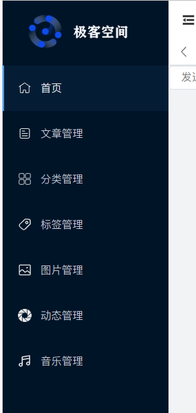

# 1.整体架构
**1.页头**
1. 搜索按钮 - 点击开启搜索弹框进行搜索
2. 刷新按钮 - 点击刷新页面（刷新主内容区域的页面内容-——刷新路由）
3. 全屏按钮 - 点击切换全屏
4. 主题按钮 - 点击切换主题（默认，黑暗，蓝色）
5. 消息通知按钮 - 点击跳转到消息通知面板
6. 用户头像及昵称 - 点击显示用户快捷操作面板
7. 内容区域放大按钮 - 点击放大内容区域 / 内容区域全屏

**2.侧边栏**

1. 网站logo展示 - 单击跳转到前台页面
2. 导航菜单 - 点击跳转到对应页面
3. 侧边栏收缩按钮 - 点击收缩侧边栏

**3.网站设置**:

1. 布局设置
2. logo显示
3. Header显示
.....

<!-- ## Configure i18n

Modify `docusaurus.config.js` to add support for the `fr` locale:

```js title="docusaurus.config.js"
export default {
  i18n: {
    defaultLocale: 'en',
    locales: ['en', 'fr'],
  },
};
```

## Translate a doc

Copy the `docs/intro.md` file to the `i18n/fr` folder:

```bash
mkdir -p i18n/fr/docusaurus-plugin-content-docs/current/

cp docs/intro.md i18n/fr/docusaurus-plugin-content-docs/current/intro.md
```

Translate `i18n/fr/docusaurus-plugin-content-docs/current/intro.md` in French.

## Start your localized site

Start your site on the French locale:

```bash
npm run start -- --locale fr
```

Your localized site is accessible at [http://localhost:3000/fr/](http://localhost:3000/fr/) and the `Getting Started` page is translated.

:::caution

In development, you can only use one locale at a time.

:::

## Add a Locale Dropdown

To navigate seamlessly across languages, add a locale dropdown.

Modify the `docusaurus.config.js` file:

```js title="docusaurus.config.js"
export default {
  themeConfig: {
    navbar: {
      items: [
        // highlight-start
        {
          type: 'localeDropdown',
        },
        // highlight-end
      ],
    },
  },
};
```

The locale dropdown now appears in your navbar:


## Build your localized site

Build your site for a specific locale:

```bash
npm run build -- --locale fr
```

Or build your site to include all the locales at once:

```bash
npm run build
``` -->
