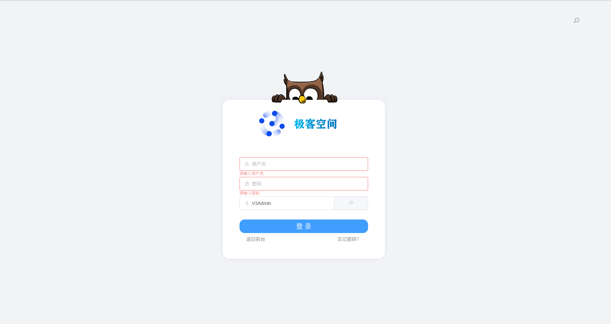

# 2.登录页面

## 页面截图

## 功能介绍
1. 用户输入
用户名：用户需要在此处输入其用于登录系统的用户名。

密码：用户需要在此处输入与用户名关联的密码。

验证码：用户需要输入显示的验证码，以确保登录请求是由真实用户发起的（此处使用模拟验证码形式）。

2. 登录按钮
用户填写完用户名、密码（以及验证码，如果适用）后，可以点击登录按钮来提交登录请求。

3. 登录失败提示
如果用户输入的用户名或密码错误，或者验证码错误，则登录失败。此时，系统会提示用户输入错误，并要求用户重新输入。
4. 登录成功提示
如果用户输入的用户名和密码正确，并且验证码正确（如果适用），则登录成功。此时，系统会提示用户登录成功，并跳转到后台管理页面首页。

## 技术重点
此页面的技术重点在于用户登录逻辑验证，包括用户名、密码的校验。以及用户登录状态的保存（token）与用户跳转。