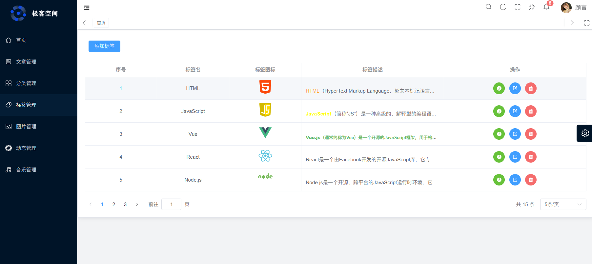

# 5.标签页面
## 页面截图

## 功能介绍
**1. 标签列表：**
文章标签内容，图片，名称，描述，创建时间，操作（编辑，删除）。

**2. 标签添加：**
通过drawer弹框编辑标签信息，上传添加标签。

**3. 标签编辑：**
获取标签详情，通过drawer弹框回显编辑标签信息。

**4. 标签删除：**
点击删除按钮，弹出确认框，确认删除后，删除标签。（永久删除）

**5. 标签详情预览:**
点击标签详情预览按钮，打开弹框渲染标签详情数据。

## 技术重点
**1. 标签添加：**
标签添加过程表单校验，图片上传，标签添加成功后，关闭弹框。（注意： 标签位置只允许上传svg图标）

**2. 标签列表编渲染及分页：**
通过el-table组件渲染标签列表，使用分页插件渲染分页。