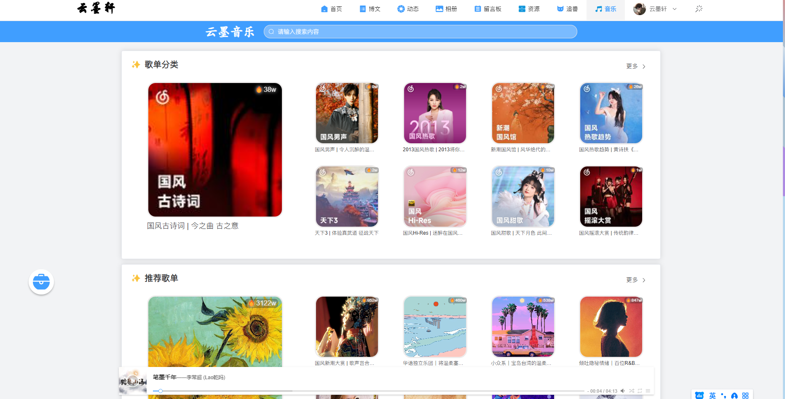
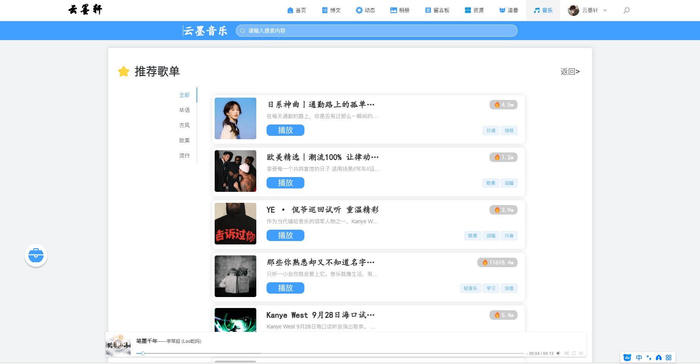
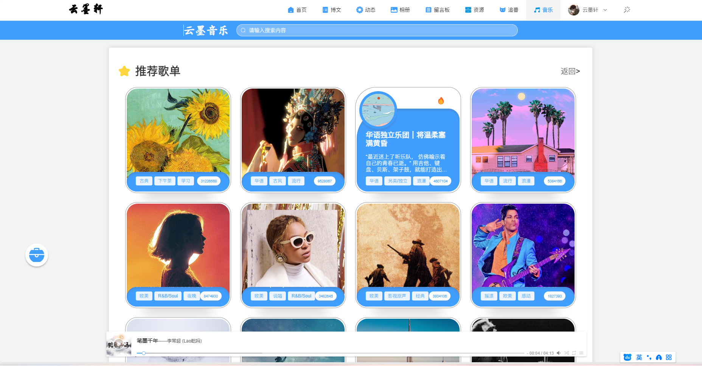
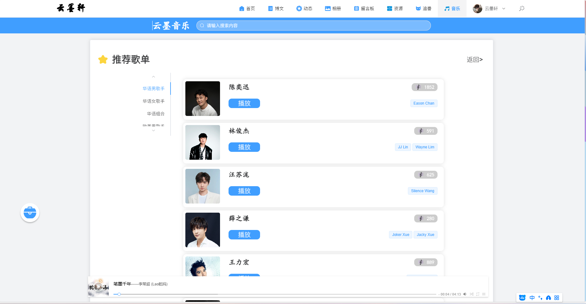
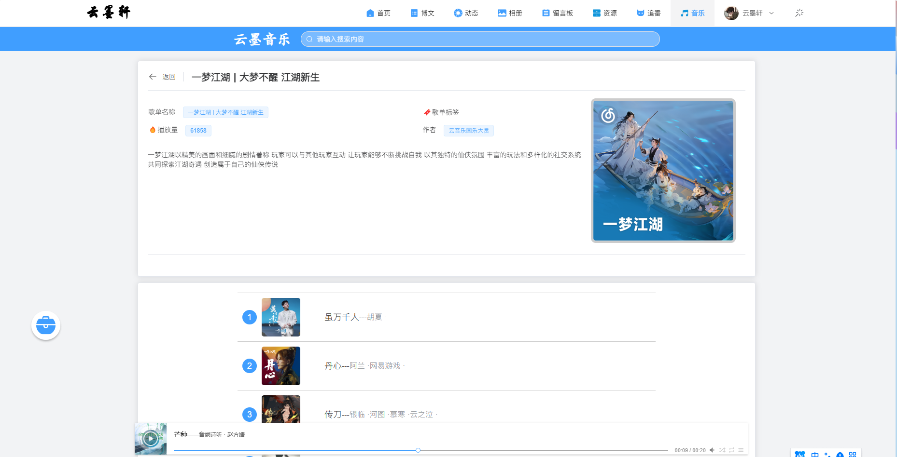
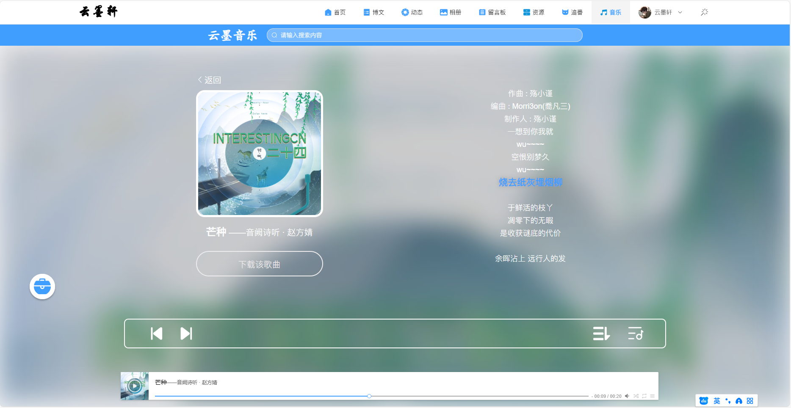
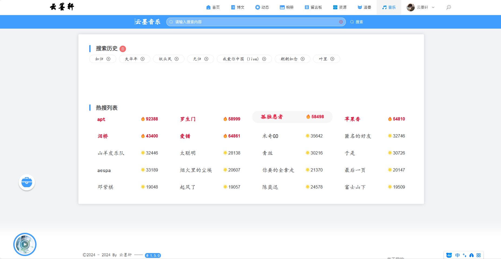

# 10.音乐模块
## 1. 音乐首页
;

## 2.音乐分类
**1. 音乐专辑分类**
;
- 点击页面歌单分类右侧更多，进入歌单分类列表。
- 点击歌单分类列表左侧列表栏，显示该分类下的歌单列表。
- 点击对应的歌单，进入该歌单详情页面。
**2. 音乐歌单分类**
;
**3. 音乐歌手分类**
;

# 3. 音乐详情
;
- 点击歌曲，就会播放器中播放当前歌曲
- 点击播放器进入播放详情页面
## 4. 音乐播放
;
- 点击播放条进入
- 左侧下载按钮，下载当前歌曲
- 右侧当前歌曲歌词
- 底部控制条切换播放模式，播放列表，上一首，下一首，播放/暂停
- 播放条可以控制播放进度条，音量条，暂停等。
## 5. 音乐搜索
;
- 输入搜索内容，按照搜索内容进行搜索
- 点击搜索提示，进入搜索结果页面
- 搜索历史为本地存储，点击清除按钮，清空搜索历史
- 底部有热搜列表，点击热搜列表，进入搜索结果页面